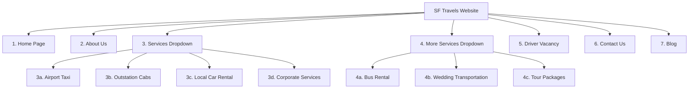

# SF Travels - Content Architecture & Navigation Structure

This document establishes the official Information Architecture (IA) and navigation flow for the new **SF Travels (Smooth Ride On Time)** website. 

All content has been organized sequentially to match the header navigation menu. The copy has been improvised to sound highly premium, corporate-friendly, and trust-inducing, incorporating Gagan's Dark Blue/Gold aesthetic and corporate slab rates.

---

## 🗺️ Navigation Map & Page Directory

---

## 📁 Content File Directory

We have organized the improvised, section-by-section copy into the following files inside the `content/` folder:

1.  **[content/01_home.md](file:///e:/softwares/sftravels/content/01_home.md)**: Landing page sections, hero banners, stats, trust pillars, and fleet catalogs.
2.  **[content/02_about.md](file:///e:/softwares/sftravels/content/02_about.md)**: High-trust background, mission, vision, and core brand values.
3.  **[content/03_services/](file:///e:/softwares/sftravels/content/03_services/)**:
    *   **[airport_taxi.md](file:///e:/softwares/sftravels/content/03_services/airport_taxi.md)**: Airport pick-up/drop specs.
    *   **[outstation_cabs.md](file:///e:/softwares/sftravels/content/03_services/outstation_cabs.md)**: Round-trip and one-way guidelines.
    *   **[local_car_rental.md](file:///e:/softwares/sftravels/content/03_services/local_car_rental.md)**: Hourly package grids.
    *   **[corporate_services.md](file:///e:/softwares/sftravels/content/03_services/corporate_services.md)**: **Corporate Slab Rate Card** (Gagan's flyer info), billing plans, and attachment criteria.
4.  **[content/04_more_services/](file:///e:/softwares/sftravels/content/04_more_services/)**:
    *   **[bus_rental.md](file:///e:/softwares/sftravels/content/04_more_services/bus_rental.md)**: Heavy transit vehicle specifications (21–50 seaters).
    *   **[wedding_transport.md](file:///e:/softwares/sftravels/content/04_more_services/wedding_transport.md)**: Chauffeur-driven luxury travel guides.
    *   **[tour_packages.md](file:///e:/softwares/sftravels/content/04_more_services/tour_packages.md)**: Itineraries for popular getaways (Ooty, Mysore, Coorg).
5.  **[content/05_driver_vacancy.md](file:///e:/softwares/sftravels/content/05_driver_vacancy.md)**: Chauffeur career descriptions and vacancy details.
6.  **[content/06_contact_us.md](file:///e:/softwares/sftravels/content/06_contact_us.md)**: Touchpoints, address, operational hours, and map data.
7.  **[content/07_blog.md](file:///e:/softwares/sftravels/content/07_blog.md)**: Sample premium, high-trust travel guide article.

---

### 🎨 Theme & Voice Improvised Standards
*   **Font Pairing**: Outfit (Headers) & Inter (Body Copy) to evoke professional excellence.
*   **Style**: Instead of generic, repetitive copy, the text utilizes a sophisticated corporate style focusing on safety, transparency (flat billing rates), absolute punctuality, and fleet cleanliness.
*   **CTAs**: Every service block has dual Call-to-Actions (CTAs) pointing to **Instant Booking Modal** or **Direct Chauffeur WhatsApp**.
